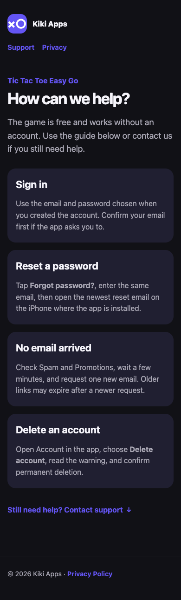
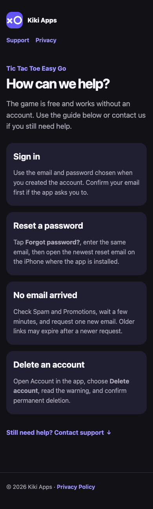
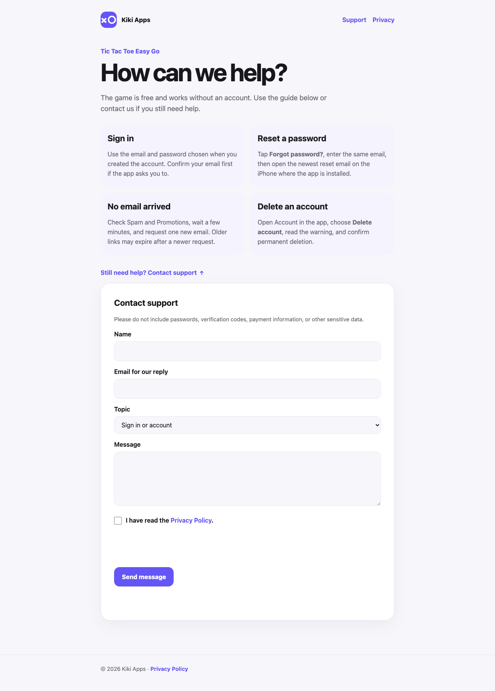

# QA Report: kiki-apps.uk

| Field | Value |
|---|---|
| Date | 20 August 2026 |
| Scope | Support and Privacy pages; mobile/desktop; Light/Dark; keyboard; no-JavaScript readability; WCAG 2 A/AA; support-form error path |

## Summary

| Severity | Count |
|---|---:|
| Critical | 0 |
| High | 0 |
| Medium | 2 |
| Low | 0 |
| Total | 2 |

## Issues

### ISSUE-001: Purple links fail WCAG AA contrast in Dark mode

| Field | Value |
|---|---|
| Severity | medium |
| Category | accessibility / visual |
| URL | `https://kiki-apps.uk/support` |
| Repro Video | N/A — static issue |
| Status | Fixed and verified in production |

The WCAG 2 A/AA axe-core audit reports five `color-contrast` failures in Dark mode: the Support and Privacy navigation links, the product eyebrow, the contact-form summary link, and the Privacy Policy footer link. The same page passes in Light mode, and the Privacy page passes its tested Light-mode audit.

The Dark-mode link color was changed to `#9c93ff` (contrast ratio about 7.20:1 against `#111116`). After the production deployment, the same axe-core audit reports zero violations.

### ISSUE-002: Turnstile can miss rendering when the form is opened immediately

| Field | Value |
|---|---|
| Severity | medium |
| Category | functional / race condition |
| URL | `https://kiki-apps.uk/support` |
| Repro Video | N/A |
| Status | Fixed and deployed |

The Turnstile API is loaded asynchronously. If the disclosure was opened before the API finished loading, the first render attempt returned without creating a widget and was never retried. The page now listens for the API script's `load` event and renders the widget when the disclosure is already open. It also displays a readable error if the security script itself fails to load.

Automated Chromium is identified as a bot by managed Turnstile, so it cannot complete a production token challenge. The negative production API path was verified separately: an invalid token returns HTTP 403 with valid JSON (`The security check failed. Please retry.`) and does not create a message. A human-completed production submission remains the final form-delivery check.

## Completed checks

- Support: 390×844 Dark mode and 1440×1000 Light mode.
- Privacy: 390×844 Light mode.
- axe-core WCAG 2 A/AA: zero production violations after the Dark-mode fix.
- Keyboard: the disclosure receives focus, opens with Enter, and focus continues to the Name field.
- JavaScript disabled: the support guidance, native disclosure, form fields, privacy link, and footer remain readable and keyboard-accessible.
- Support API error response: HTTP status, JSON parsing, and user-facing security error verified in production.
